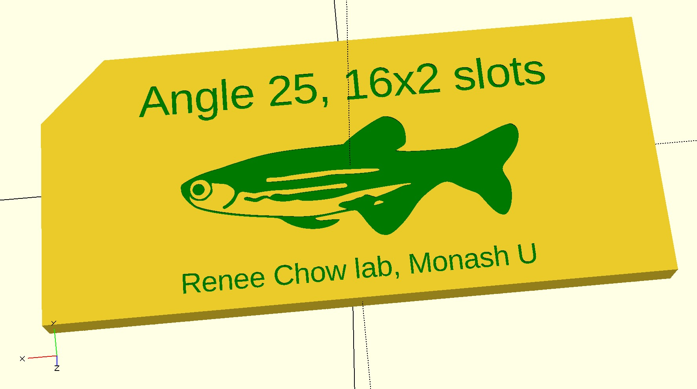
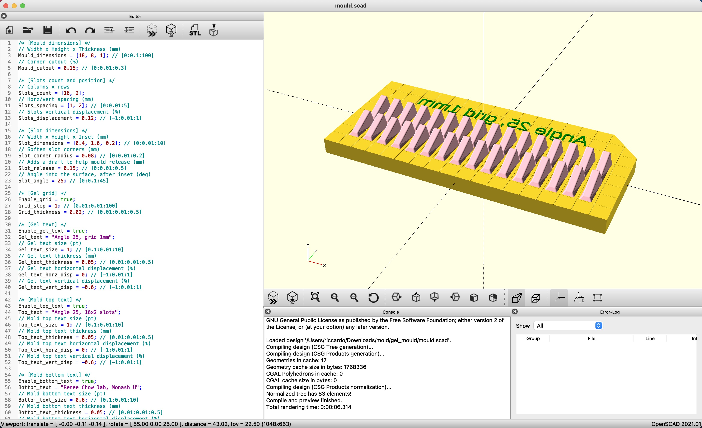
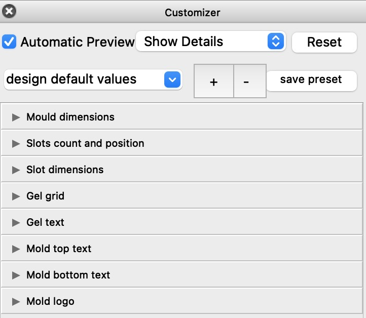
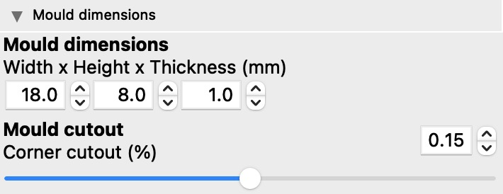
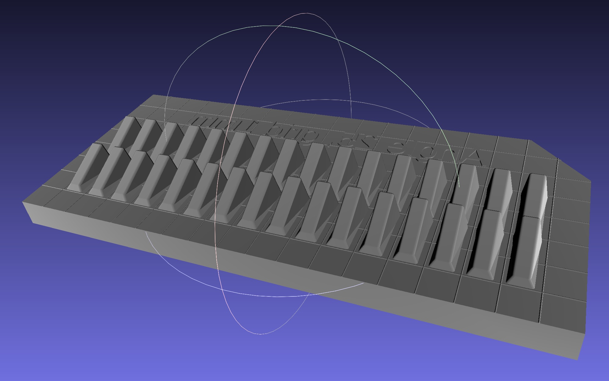

# Parametric gel mould
A parametric mould for mounting fish embryos on gels.

Please support our lab's work by citing the following work, which features the original design of the moulds:
Chow, R. W. Y., Lamperti, P., Steed, E., Boselli, F., Vermot, J. Following Endocardial Tissue Movements via Cell Photoconversion in the Zebrafish Embryo. <em>J. Vis. Exp.</em> (132), e57290, doi:10.3791/57290 (2018).

### Instructions
* Install [OpenSCAD](https://openscad.org/downloads.html)
* Clone the repository: ```git clone https://github.com/r1cc4rdo/gel_mould.git```
* Open ```mould.scad```

You should now be staring at a window similar to the following:


### Changing mould parameters
You can either change the parameters directly in the code, or use OpenSCAD's part customizer.

To enable the customization view uncheck *Hide Customizer* from the *Window* menu.

| Parameters' groups | Mould dimensions' pane |
| ---- | ---- |
|  |  |

### Export the mould for 3D printing
* Generate final render: press the *Render* button (shortcut: *F6*)
* Export the final model as .stl: press the *Export as STL* button (shortcut: *F7*).
The first time you render/export, it might take up to a few minutes; grab yourself a coffee.
* You can inspect the resulting [mould.stl](mould.stl) with [Meshlab](https://www.meshlab.net/#download)


